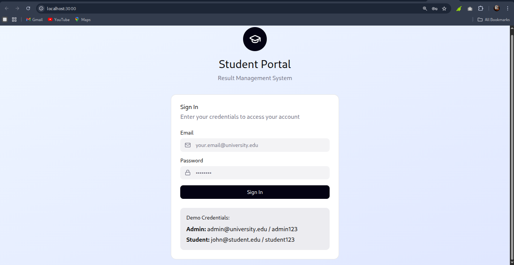
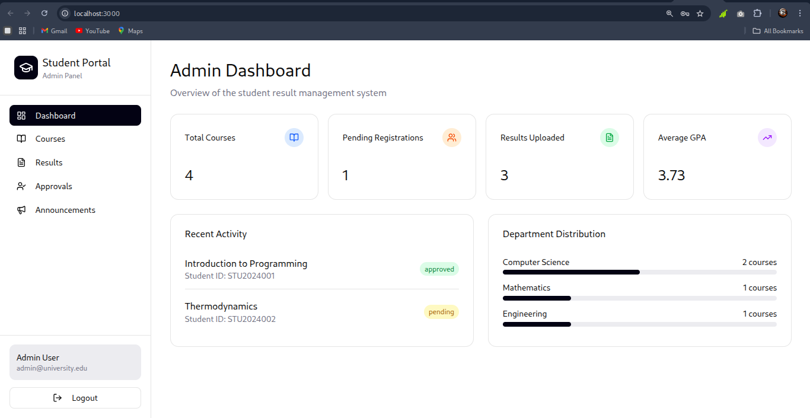
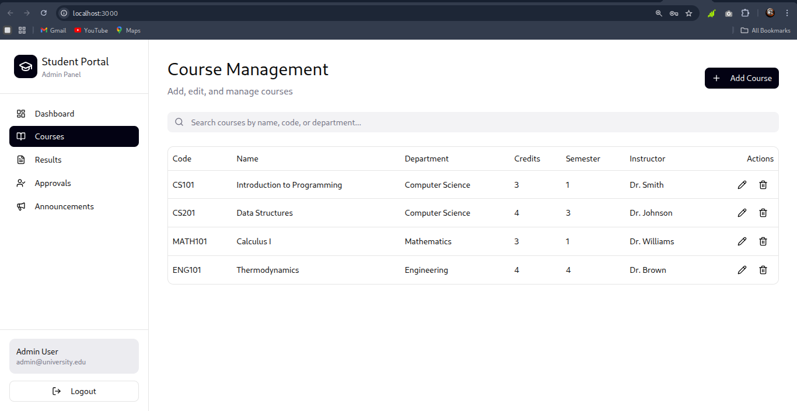
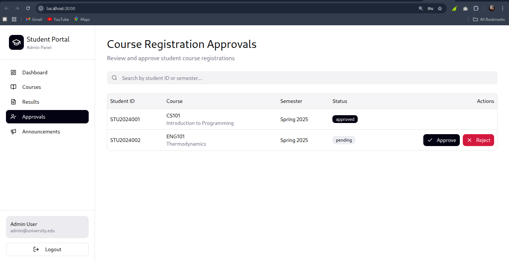
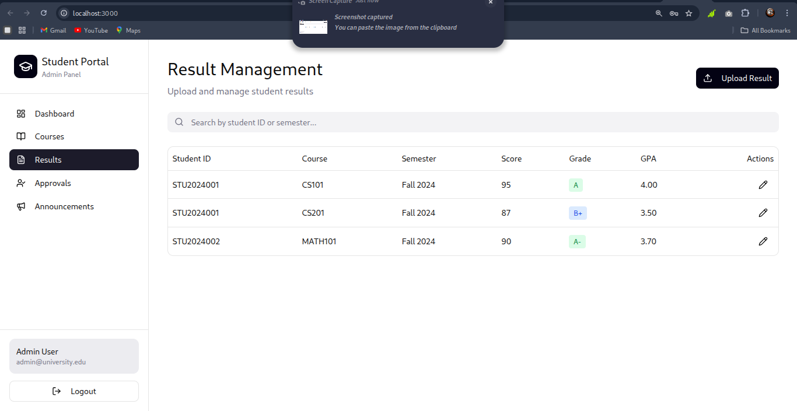

  # Student Result Management Portal

  This repository contains the Student Result Management Portal UI built with React + Vite.

  ## Quick start

  Install dependencies:

  ```bash
  npm install
  ```

  Start the dev server:

  ```bash
  npm run dev
  ```

  Build for production:

  ```bash
  npm run build
  ```


  ## Screenshots / UI gallery


  
  
  
  
  
  


